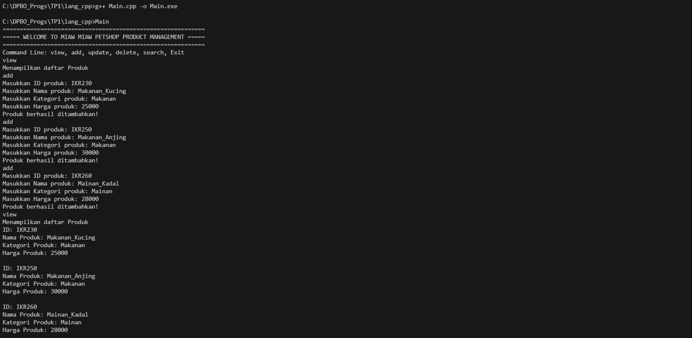
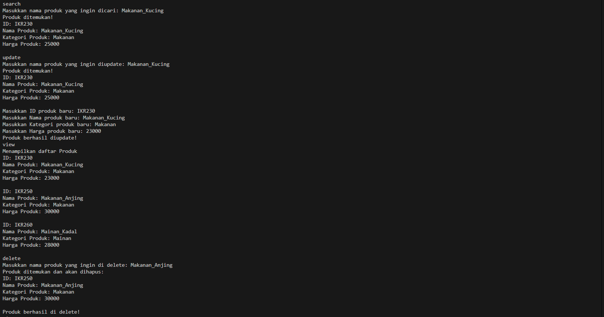
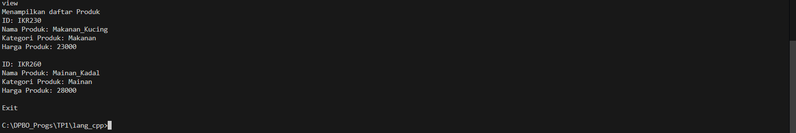
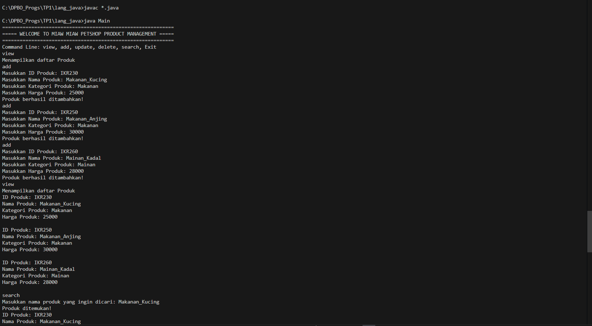
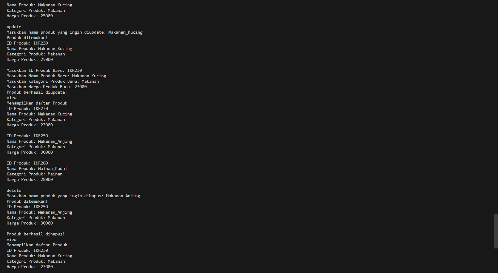
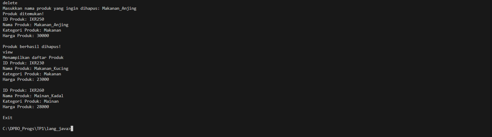
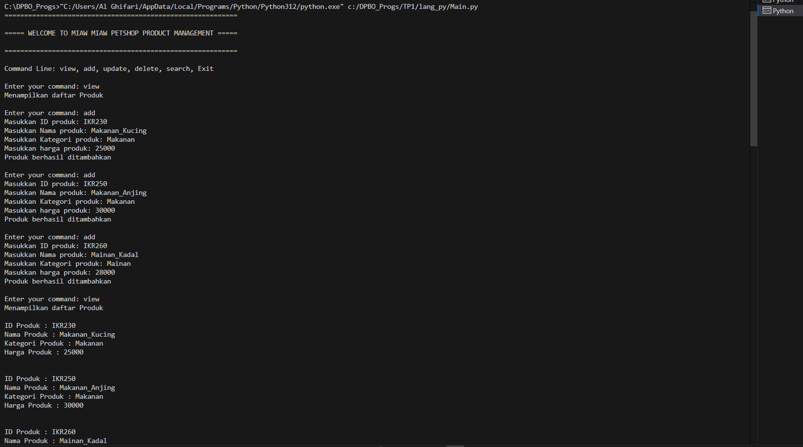
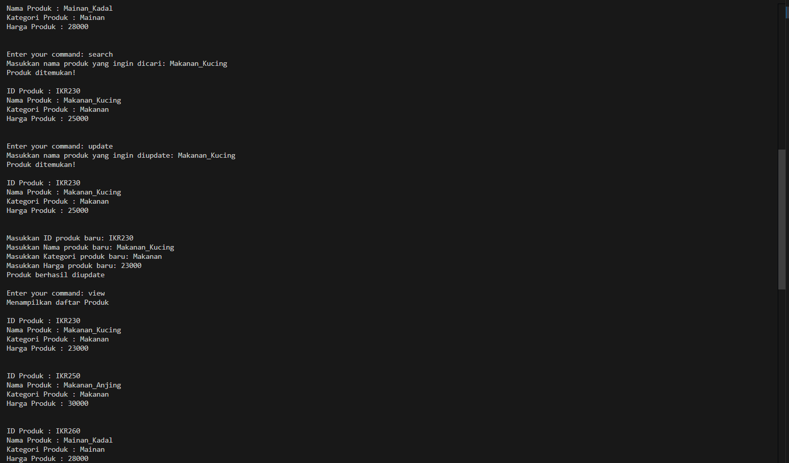
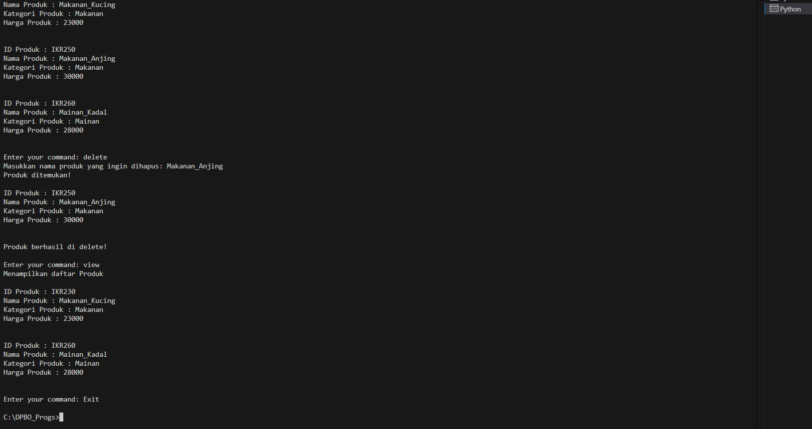
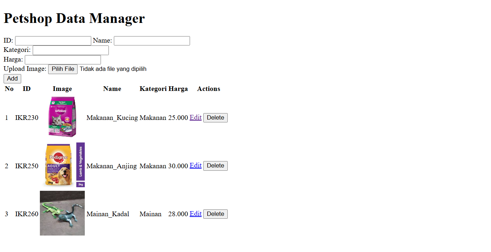

# TP1DPBO2025C2

## Janji 
Saya Abdurrahman Al Ghifari mengerjakan evaluasi Latihan Modul dalam mata kuliah 
Desain Pemrograman Berbasis Object untuk keberkahanNya maka saya tidak melakukan kecurangan 
seperti yang telah dispesifikasikan. Aamiin.

## Desain Program
Progam yang dibuat terdiri dari 2 file utama, yaitu Main file dan class file
class file pada kasus ini adalah Class Petshop
Class Petshop terdiri dari 4 atribut utama dan 1 atribut khusus untuk bahasa PHP
Atribut Umum:
* ID Produk
* Nama Produk
* Kategori Produk
* Harga Produk

Atribut Khusus:
* Gambar Produk (Bahasa PHP)

## Alur Program
- Program dimulai dengan ditampilkannya informasi awal yang bisa dilakukan user
- Terdapat 5 Fitur utama dan 1 command untuk mengakhiri program yang tergabung menjadi 6 Command Line
    - **view** -> untuk menampilkan data yang tersedia
    - **add** -> untuk menambahkan data
    - **update** -> untuk mengupdate/memperbaharui data yang sudah ada
    - **delete** -> untuk menghapus data
    - **search** -> untuk mencari data dengan kata kunci nama produk
    - **Exit** -> untuk keluar dari program

## Dokumentasi Program C++

## Dokumentasi Program Java

## Dokumentasi Program Python

## Dokumentasi Program PHP
